<p align="center">
  
</p>

<h1 align="center">Hermes Gadget</h1>

<p align="center">
  <b>Hold a button. Ask Hermes. Hear the answer.</b><br>
  An open SDK for small hardware that talks to <i>your own</i> <a href="https://github.com/NousResearch/hermes-agent">Hermes Agent</a>.
</p>

<p align="center">
  <a href="https://github.com/Adolanium/hermes-gadget-sdk/actions/workflows/ci.yml"></a>
  <a href="https://github.com/Adolanium/hermes-gadget-sdk/actions/workflows/hermes.yml"></a>
  
  
  
  
  
</p>

<p align="center"><sub><b>Unofficial community project.</b> Not affiliated with or endorsed by Nous Research. Hermes, Hermes Agent and the Hermes Agent mascot are trademarks of Nous Research. <a href="#affiliation-and-trademarks">More</a></sub></p>

<p align="center">
  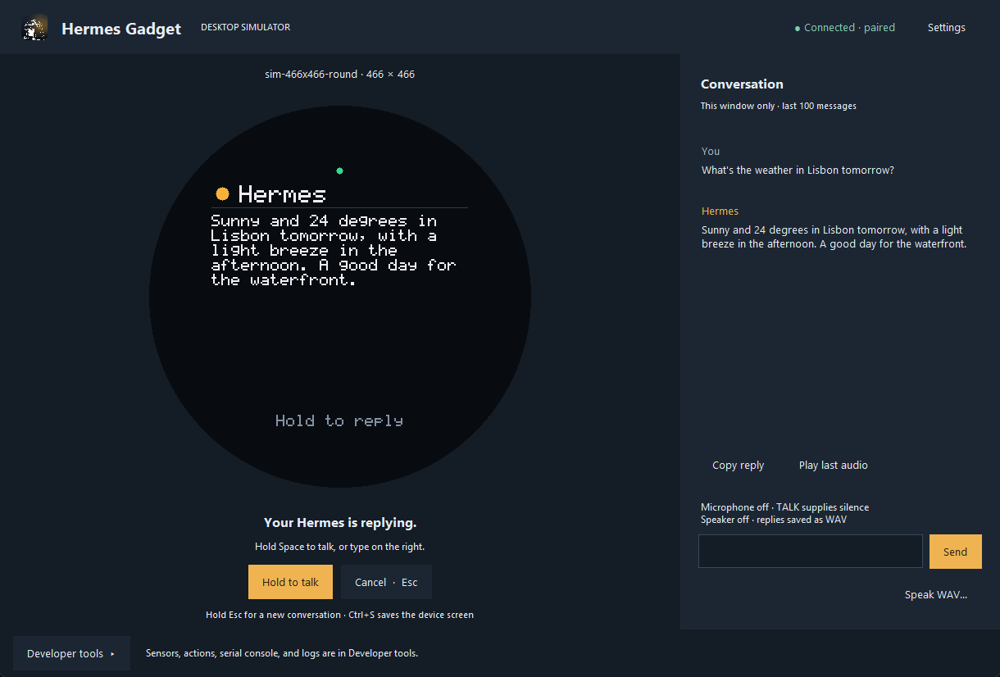
</p>

<p align="center"><i>The desktop simulator running the device firmware. Screenshot.</i></p>

An ESP32 with a small screen and a microphone becomes a push-to-talk terminal for your Hermes. It pairs with your agent like a new phone would, sends your voice, shows the answer and speaks it, and lends its LEDs, relays and sensors to the agent as tools. Your memory, skills and models stay on your Hermes; the gadget is just a very good pair of ears and a face.

<table>
  <tr>
    <td width="33%" valign="top"><b>🎙️ Voice in, voice out</b><br>Push-to-talk streams 16 kHz audio to Hermes. Its own speech-to-text and text-to-speech do the rest; with a streaming voice, it starts talking before the reply is finished.</td>
    <td width="33%" valign="top"><b>🔐 Pairs like a phone</b><br>A new device shows a code; you approve it on the Hermes host. Each device proves itself with its own key, so nothing can impersonate it.</td>
    <td width="33%" valign="top"><b>🛠️ The agent drives the device</b><br>Devices declare actions (an LED, a relay, a buzzer). Hermes can call them, put cards on the screen and read the sensors, from the device or from any other chat.</td>
  </tr>
</table>

## On the screen

| Idle | Listening | Thinking | Speaking |
|:---:|:---:|:---:|:---:|
| 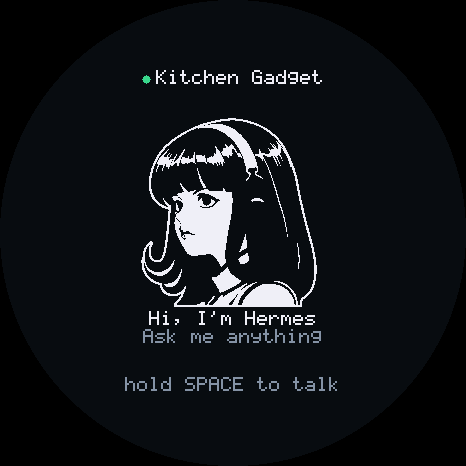 | 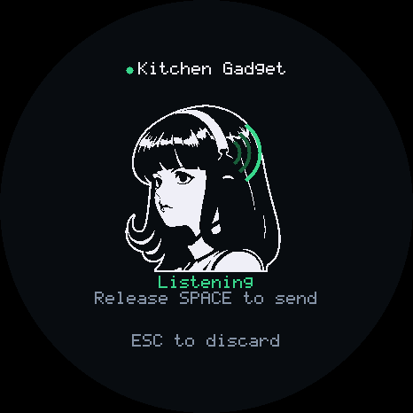 | 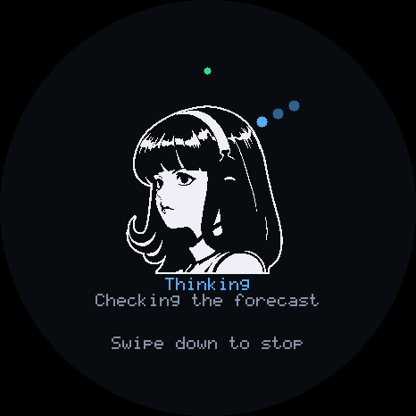 | 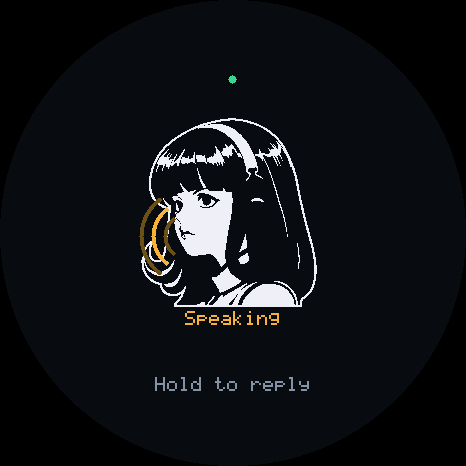 |
| **Reply** | **Question** | **Pairing** | **Agent card** |
| 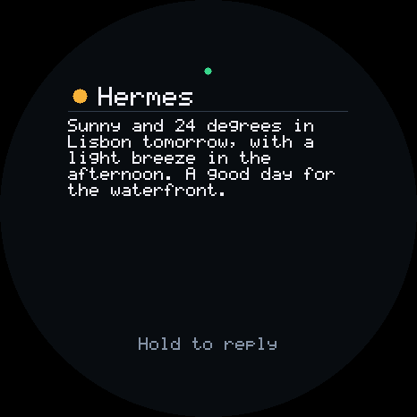 | 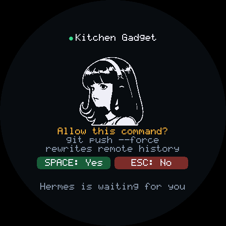 | 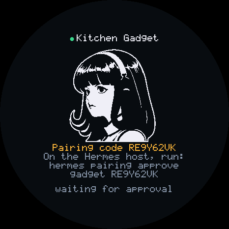 | 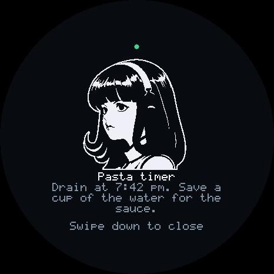 |

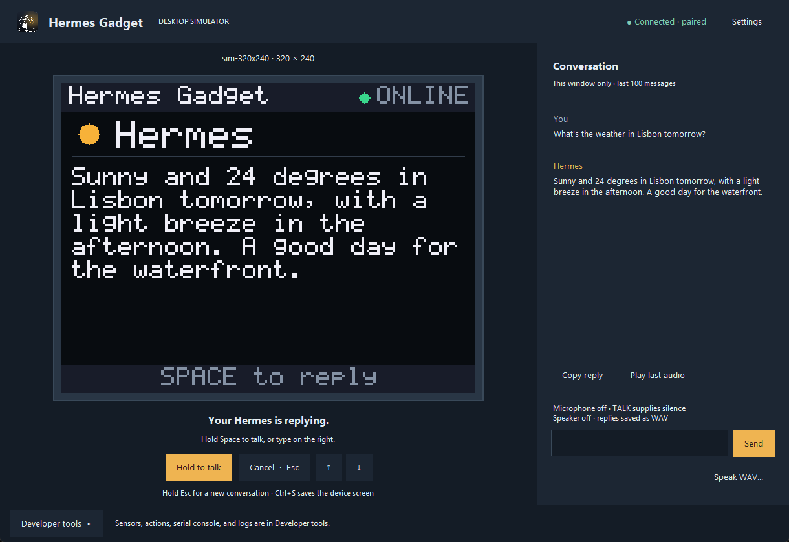

**Any screen.** The same firmware runs on the AMOLED board above and on a 320×240 breadboard build, on the right. A board without scroll buttons still works: long replies turn their own pages.

Every image on this page is a screenshot of the simulator window, captured with [`tools/capture_window.py`](tools/capture_window.py).

<br clear="right">

## How it works

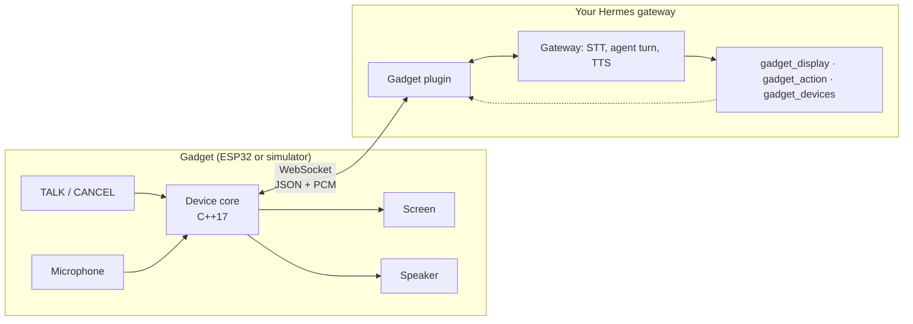

1. **Hold TALK and speak.** The device streams audio to the gadget plugin inside your Hermes gateway.
2. **Hermes does the thinking.** The plugin hands Hermes a voice message, exactly like a voice note from a messaging app. Hermes transcribes it, runs the agent turn with your tools and memory, and speaks the reply.
3. **The reply comes back** as text on the screen and audio from the speaker, with live status phrases ("Checking the forecast") in between.
4. **Hermes can reach back.** Cron results, messages from other chats and agent tools arrive over the same connection.

**Hermes itself is unchanged.** The SDK plugs in through the gateway's platform-plugin interface, the same one messaging platforms use. See [docs/hermes-integration.md](docs/hermes-integration.md).

## Quick start

**1. Try it with no hardware and no Hermes** (needs CMake and a C++17 compiler):

```bash
pip install -e ".[dev]"
hermes-gadget build-sim
hermes-gadget devserver --pairing                      # terminal 1: a stand-in for Hermes
hermes-gadget sim --url ws://127.0.0.1:8765/gadget     # terminal 2: the simulated device
```

**2. Connect it to your Hermes:**

```bash
hermes-gadget plugin install && hermes plugins enable gadget
hermes config set platforms.gadget.enabled true && hermes gateway run
hermes-gadget sim --url ws://127.0.0.1:8765/gadget --live-audio
hermes pairing approve gadget <CODE>                   # the code on the device's screen
```

**3. Build the real thing:** pick the parts below, then flash it with `pio run -e esp32s3-breadboard -t upload` from `firmware/esp32`. The full walkthrough is in [docs/getting-started.md](docs/getting-started.md). The firmware builds in CI but has not run on a board yet, so the first flash may need debugging.

## The simulator

The simulator runs the **same C++ core as the firmware** inside a desktop window. Your keyboard is the buttons, your PC's microphone and speakers are the device's, and it talks to Hermes (or the stand-in dev server) over the same WebSocket protocol. Anything that works here works on the board.

```bash
hermes-gadget build-sim                                   # once, and after changing firmware/core
hermes-gadget sim --url ws://127.0.0.1:8765/gadget --live-audio
hermes-gadget sim --url ws://127.0.0.1:8765/gadget --board sim-466x466-round
```

| Key | Does |
|---|---|
| Hold **Space** | TALK: hold to speak, release to send. Also "yes" to a question |
| **Esc** | CANCEL: discard, close, stop, or "no" to a question. Hold 2 s for a new conversation |
| **Up / Down** | Scroll a long reply |
| **Ctrl+S** | Save a screenshot |
| Text box | Type a message instead of speaking |

| Board | Screen |
|---|---|
| `sim-320x240` (default) | 320×240, like the breadboard build |
| `sim-466x466-round` | The 1.75" AMOLED touch board |
| `sim-480x320`, `sim-240x135` | Larger and smaller rectangular panels |
| `sim-240x240-nospeaker` | No speaker: replies are text only |

Each simulated device keeps its own identity in `~/.hermes-gadget/sim/<name>/`, so several can be paired at once. It also runs headless from a script, for tests and screenshots. Everything is in [docs/simulator.md](docs/simulator.md).

## Build one

> **Untested on hardware.** Both board builds compile in CI, but neither has run on a real board yet. If you build one, watch the serial console on the first boot and [open an issue](https://github.com/Adolanium/hermes-gadget-sdk/issues) with its log if something looks wrong.

| Part | Example | Notes |
|---|---|---|
| Board | ESP32-S3 DevKitC-1 N8R8 | PSRAM holds the framebuffer |
| Screen | 2" ST7789 SPI LCD, 320×240 | 240×240 and 240×135 panels work too |
| Microphone | INMP441 I2S MEMS mic | |
| Speaker (optional) | MAX98357A I2S amp + 4–8 Ω speaker | Without one, replies are text only |
| Buttons | The DevKit's BOOT button, plus one more | TALK and CANCEL |

**Prefer a ready-made board?** The Waveshare ESP32-S3-Touch-AMOLED-1.75 has a 1.75" AMOLED touchscreen, two microphones and a speaker output, and needs no wiring: `pio run -e esp32s3-touch-amoled-175 -t upload`. Hold the screen to talk, swipe down to cancel. Its drivers are written and build in CI, but have not run on the board yet; see [docs/hardware.md](docs/hardware.md#esp32-s3-touch-amoled-175).

Pinout, flashing and the serial console are in [docs/hardware.md](docs/hardware.md). Other boards are a configuration change: [docs/porting.md](docs/porting.md).

## Using it

| Do this | And this happens |
|---|---|
| Hold **TALK**, speak, let go | Hermes hears you and answers |
| Press **TALK** while it is talking | It stops and listens (barge-in) |
| Tap **CANCEL** | Discard the recording, close a card, or stop the turn |
| Hold **CANCEL** for 2 s | Start a fresh conversation |
| A question appears | **TALK** = yes, **CANCEL** = no. Covers `/new`, model switches and dangerous commands the agent wants to run |

Long replies turn their own pages, so a board without scroll buttons can still read everything.

## Under the hood

- **One core, two homes.** The protocol, pairing, push-to-talk, UI and playback live in a portable C++17 core. The ESP32 firmware and the desktop simulator compile the same files, so a bug you can reproduce in the simulator is a bug in the firmware.
- **The mascot costs about 26 KB.** She is stored as 1-bit frames (idle, blink, talk) at four sizes. The listening waves, thinking dots and speaking waves are drawn live on top of her.
- **A blink redraws about 25 rows.** The renderer hashes what each part of the screen depends on and only sends the rows that changed over SPI. Idle animation stays cheap even on a slow bus.
- **Your key crosses the network once.** On first contact the device enrolls a random 32-byte key. After that it answers a fresh challenge with an HMAC, so a recorded session can't be replayed.
- **The device stays dumb on purpose.** Markdown, Unicode, image decoding, speech recognition and synthesis all happen on the Hermes host. The firmware never needs an update to get a better voice or model.
- **The tests run without hardware or API keys.** C++ unit tests drive the core through a fake board. The Python suite pairs simulated devices with a real `hermes gateway run`, with a fake model, speech-to-text and text-to-speech behind it.

## Documentation

| Guide | What's in it |
|---|---|
| [Getting started](docs/getting-started.md) | From zero to a paired device, simulator or hardware |
| [Architecture](docs/architecture.md) | The core, rendering, the mascot, interaction, security |
| [Protocol](docs/protocol.md) | Every message between device and host |
| [Hermes integration](docs/hermes-integration.md) | How the plugin uses Hermes, configuration, making replies fast |
| [Simulator](docs/simulator.md) | Keys, boards, scripted and headless runs |
| [Hardware](docs/hardware.md) | Wiring, flashing, the serial console |
| [Porting](docs/porting.md) | New boards, displays, audio, sensors and actions |
| [Development](docs/development.md) | Repository layout and test suites |

## Repository

| Path | What it is |
|---|---|
| [`plugin/`](plugin) | The Hermes platform plugin: device hub, gateway adapter, agent tools, `hermes gadget` CLI |
| [`firmware/core/`](firmware/core) | The portable device core |
| [`firmware/esp32/`](firmware/esp32) | ESP-IDF firmware and board configurations |
| [`firmware/sim/`](firmware/sim) | The core as a library for the desktop simulator |
| [`python/hermes_gadget/`](python/hermes_gadget) | The `hermes-gadget` CLI: simulator, development server, plugin installer, provisioning |
| [`tests/`](tests), [`firmware/tests/`](firmware/tests) | Python and C++ test suites |

## Status

Version 0.1. The core, the simulator and the plugin are tested end to end against a real Hermes gateway: CI runs those tests against Hermes Agent [`2eceb02`](https://github.com/NousResearch/hermes-agent/commit/2eceb0275501b09febdec88d08b80d1fff730cf8) (October 3, 2026) on every change, and against Hermes `main` once a day. The ESP32 firmware builds cleanly in CI for the ESP32-S3 breadboard and the ESP32-S3-Touch-AMOLED-1.75, but has not run on real hardware yet. Not yet included: a wake word, Wi-Fi setup without a serial cable, and over-the-air updates.

## Affiliation and trademarks

Hermes Gadget is an **independent, community-made project**. It is not affiliated with, endorsed by, sponsored by or supported by Nous Research.

"Hermes", "Hermes Agent", "Nous Research" and the Hermes Agent mascot (the girl with the headphones, sometimes called "Nous Girl") are trademarks or brand assets of Nous Research. They appear here only to describe compatibility with Hermes Agent.

## License

The code and documentation are MIT licensed; see [LICENSE](LICENSE). That license covers this project's own work and grants no rights to Nous Research's names or marks.

The mascot artwork, and the logo and device bitmaps drawn from it, come from [Hermes Agent](https://github.com/NousResearch/hermes-agent) (MIT, © 2025 Nous Research); see [assets/mascot](assets/mascot) and [NOTICE](NOTICE).
